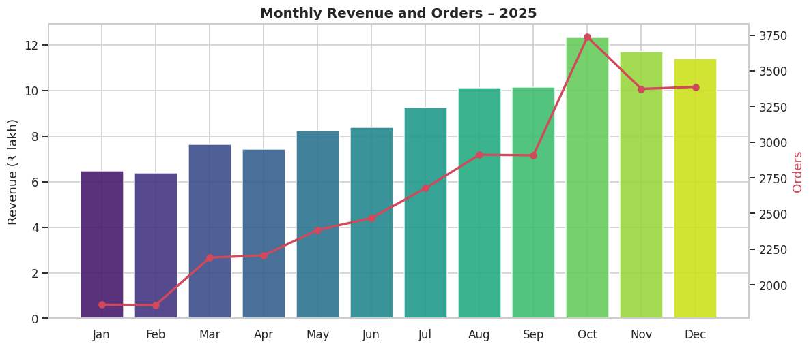
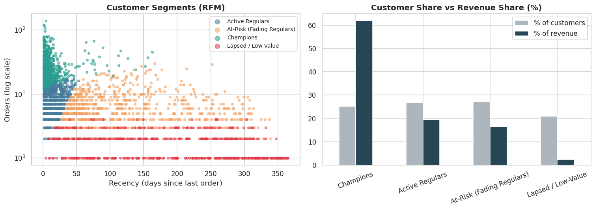
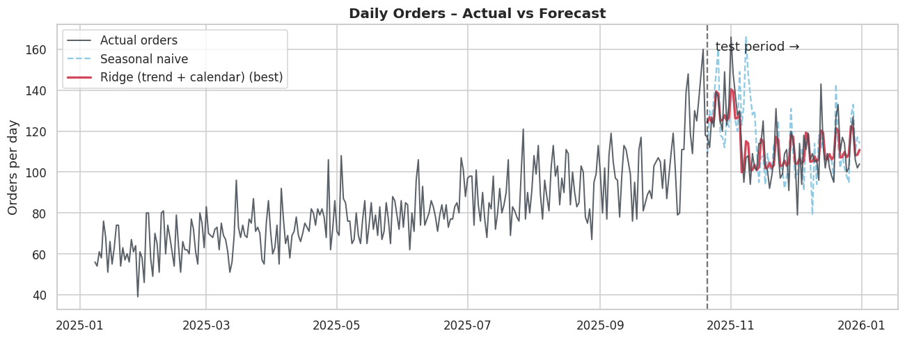

# 🛒 Quick-Commerce Sales, Customer & Delivery Analytics with AI

**IBM SkillsBuild – Data Analytics with AI Internship 2026 (AICTE × BharatCares)**

An end-to-end data analytics and machine-learning project on a Blinkit-style quick-commerce business: what sells, who the valuable customers are, why deliveries run late, and how many orders to expect tomorrow.

> **Author:** [Keshav Kumar]  · **GitHub:** [repository link]

---

## 📌 Project Description

Quick-commerce apps (Blinkit, Zepto, Swiggy Instamart) promise delivery in minutes. Profitability depends on basket value, customer retention and on-time delivery. This project analyses a year of order data (31,960 orders · 6 cities · Jan–Dec 2025) to answer:

1. Which categories, cities and time slots drive revenue?
2. Who are the best customers, and who is about to churn?
3. What causes late deliveries, and can they be predicted?
4. How many orders should be expected tomorrow?
5. Do discounts actually increase basket size?

## 🤖 AI / ML Components

| Component | Technique | Result |
|---|---|---|
| Customer segmentation | RFM + K-Means (k = 4) | Champions = 25% of customers but 62% of revenue; 731 fading regulars identified for win-back |
| Late-delivery prediction | Logistic Regression, Random Forest, Gradient Boosting | Best: **Gradient Boosting**, ROC-AUC **0.91** |
| Demand forecasting | Ridge (trend + calendar) vs Random Forest & naive baselines | **50% lower error** than last-week baseline (MAE 6.8 vs 13.6 orders/day) |
| Automated insight engine | Statistical rule-based narrative | Writes the management summary directly from the data |

## 📊 Key Findings

- Revenue grew **76%** from January to December; **Oct** (festive season) was the best month.
- KPIs: total revenue **₹10,945,839**, AOV **₹342**, on-time delivery **82.5%**.
- Late-delivery rate is **32.7%** in rain vs **13.3%** when dry, and **23.8%** in peak hours vs **13.5%** off-peak.
- Discounts show no relationship with basket size (correlation +0.00) while costing **₹608,165** (5.3% of gross sales).
- Main drivers of late delivery: distance, packing time and rain.





## 🗂 Dataset

> ⚠️ **Data note:** real Blinkit order-level data is not publicly available. This project uses a **synthetic, seeded (seed = 42) dataset** that mimics quick-commerce behaviour (peak hours, rain effect, festive spike, churn, and deliberately dirty records: duplicates, missing values, logging errors).

- **Generated inside the notebook** (Section 3, `generate_dataset()`), so results are fully reproducible.
- **Dataset files in this repo:** [`data/blinkit_orders_raw.csv`](data/blinkit_orders_raw.csv) (raw, with issues) · [`data/blinkit_orders_clean.csv`](data/blinkit_orders_clean.csv) (cleaned + engineered features)
- **Use your own data:** set `REAL_DATA_PATH = "your_file.csv"` in Section 3 of the notebook. The CSV needs the same columns (`order_id, customer_id, order_datetime, city, is_member, age_group, category, items_count, discount_pct, order_value, payment_method, distance_km, is_raining, prep_time_min, promised_time_min, delivery_time_min, rating, refund_requested`).
- Similar public datasets to try on Kaggle: search for *Blinkit*, *Zepto* or *Instamart* sales datasets.

## 🛠 Technologies Used

Python 3.10+ · Pandas · NumPy · Matplotlib · Seaborn · Scikit-learn · Jupyter Notebook

## ⚙️ Setup & Run

```bash
# 1. Clone the repository
git clone <your-repo-url>
cd <repo-folder>

# 2. (Optional) create a virtual environment
python -m venv venv
venv\Scripts\activate          # Windows
# source venv/bin/activate     # macOS / Linux

# 3. Install dependencies
pip install -r requirements.txt

# 4. Open the notebook and run all cells
jupyter notebook YourName_QuickCommerceAnalytics.ipynb
```

Run time is under two minutes. The notebook creates the `data/` and `charts/` folders automatically.

## 📁 Project Structure

```
├── YourName_QuickCommerceAnalytics.ipynb   # Main notebook: cleaning, EDA, ML models, insights
├── requirements.txt                        # Python dependencies
├── YourName_ProjectReport.docx             # Full project report
├── README.md                               # This file
├── data/                                   # Raw & clean datasets, RFM segments, auto-insights
└── charts/                                 # All figures generated by the notebook
```

## 🚀 Future Scope

- Run on real order logs and add SKU-level market-basket analysis
- Streamlit dashboard with live filters
- LLM layer for plain-English questions ("why was Bengaluru late on Friday?")
- Threshold tuning using real refund and late-delivery costs

## ⚠️ Limitations

Because the data is synthetic, absolute numbers are illustrative; the **methodology and pipeline** are what transfer to real data.

---
*Built for the IBM SkillsBuild Data Analytics with AI Internship 2026, in association with AICTE and BharatCares.*
